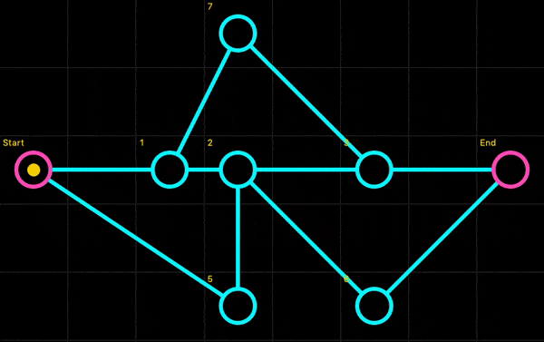

<div id="top"></div>

<!-- PROJECT LOGO -->
<br />
<h1>LEM-IN : C PROGRAM</h1>

<div align="center">
    
</div>

# Description :

Lem_in is a program whose role is to move N ants through a graph from vStart to vEnd in the least amount of __steps__.
The program reads the graph details and number of ants from the standard input.

Following conditions apply :
  * the graph is non-oriented
  * graph details and number of ants are given at launch
  * __constraints__ : the vertices and edges have a one ant capacity
  * __step__ : moving all possible ants simultaneously without breaking the __constraints_

# How To Use

<br />

* Git clone the repositery :<br /> 
```
git clone git@github.com:Kcarttigueane/Dante-s-star.git
```
* First build the project executing : <br />
```
make
```
* Run the program :<br />
```
./lem_in < file.txt`
```

## File specifications : 

* The rooms’ coordinates will always be whole numbers. <br />
* Please note that it is possible to insert comments by using “#” and commands by using “##”.<br />
* ##start indicates the next room is the anthill entrance, and ##end indicates the next room is the anthill exit.<br />
* Any unknown commands will be ignored.
* You must show the result on the standard output, in this order: number_of_ants, rooms, tunnels and then
for each lap, a series of <strong>Pn-r</strong> where <strong>n</strong> is the <u>number of the ant</u>, and <strong>r</strong> the <u>name of the room</u> it gets into.
In the output, you must display a comment indicating the part that will follow. These comment must be
exactly like in the examples.

> :warning: The first noncompliant or empty line will lead to the end of the anthill acquisition, as
well as its normal treatment with the data that has already been acquired.

File example :


Program execution : 


<p align="right">(<a href="#top">back to top</a>)</p>
